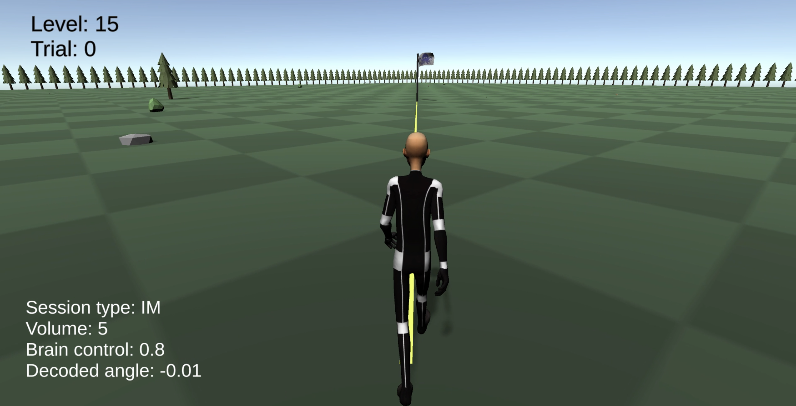

# avatarRT_task

This repository contains 1) the Unity 3D project for the video game task which was used in our real-time fMRI experiment and 2) the python scripts / environment used to drive the experiment. Note that the python scripts reference the rt-cloud project environment; to run the experiment with rt-cloud, the python script `avatarRT.py`, `avatarRT_presentation.py`, `configure_config.py`, `run_subject_service.py` will need to be placed inside of a rt-cloud project directory such as [here](https://github.com/ericabusch/rt-cloud) (see the avatarRT directory).

For a demonstration of the game as participants saw inside the scanner, see the video `demo/participant-display`. As an example of how the decoded neurofeedback values and the Brain Control parameter resulted in the on-screen display, see the video `demo/im-session-demo`, which shows a participant's real decoded values and resulting feedback display during the experiment. Note that the white text displayed on the bottom left was NOT shown to participants, but rendered for the sake of this example.

To run the Unity experiment, you will need to change the path to the parameters file (`experimenter_computer/experiment/params.txt`) to match your computer's local filepath -- both in line 3 of the params.txt file and in the Unity script found at `Assets/Scripts/InfoLoader.cs`. When you hit the play button in the Unity app (Unity version 2019.4.12f1), the game will automatically begin reading in files from the path `experimenter_computer/experiment/subjects/$PARTICIPANT_ID/$SESSION_ID/$RUN_ID/scanner_comms`. These will be read in immediately, but if you wish to generate them at the speed of the fMRI scanner, you can run `simulate_scanner_output.py` and change the output path in that script to your `experimenter_computer/experiment/subjects/$PARTICIPANT_ID/$SESSION_ID/$RUN_ID/scanner_comms`. 

